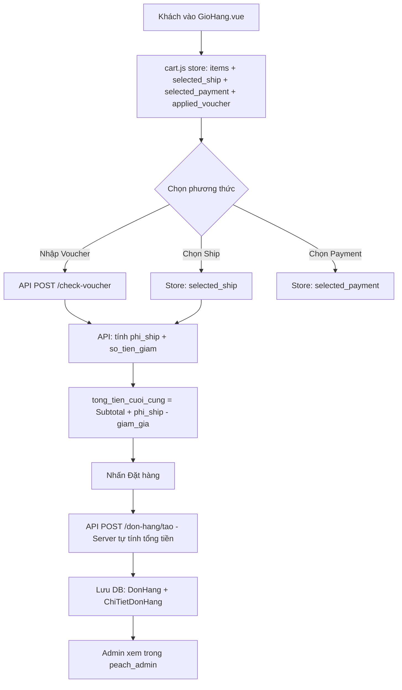

# KẾ HOẠCH TRIỂN KHAI HỆ THỐNG ĐẶT HÀNG - PEACH STORE

## Tổng quan kiến trúc hiện tại

### Backend (FastAPI + SQLAlchemy + PostgreSQL)
- **Models hiện có:** `NguoiDung`, `SanPham`, `GioHang`, `DonHang`, `ChiTietDonHang`
- **DonHang model:** `id`, `user_id`, `ten_khach_hang`, `so_dien_thoai`, `dia_chi`, `ghi_chu`, `tong_tien`, `trang_thai`, `is_visible_user`, `ngay_tao`, `ngay_cap_nhat`
- **API hiện có:** Xác thực, Sản phẩm, Giỏ hàng, Đơn hàng (CRUD cơ bản), Admin Dashboard

### Frontend (Vue 3 + Pinia + Vue Router)
- **GioHang.vue:** Form thông tin KH, danh sách SP, nút checkout - **chưa có** Voucher/Shipping/Payment UI
- **cart.js store:** `items[]`, `count`, `total` getters - **chưa có** selected_ship/payment/voucher state
- **api.js:** `donHangApi.taoDonHang()` gửi `tong_tien` từ client - **cần server-side calculation**

### Admin Dashboard (peach_admin - Vanilla JS)
- **Vouchers.html:** Giao diện tĩnh - **chưa có** data binding, CRUD API
- **Shipping.html:** Giao diện tĩnh - **chưa có** data binding
- **Payments.html:** Giao diện tĩnh - **chưa có** data binding
- **Orders.html:** Có sẵn quản lý trạng thái, xóa đơn

---

## Luồng dữ liệu tổng thể



---

## Kế hoạch triển khai chi tiết

### Bước 1: Backend - Database & API (Voucher, Shipping, Payment)

#### 1.1 Tạo Model `Voucher`
| Field | Type | Ghi chú |
|-------|------|---------|
| `id` | Integer, PK | |
| `ma_voucher` | String(50), unique | Mã code khách nhập |
| `loai_giam_gia` | String(20) | `phan_tram` hoặc `so_tien` |
| `gia_tri_giam` | Float | 10 (cho %) hoặc 200000 (cho số tiền) |
| `don_hang_toi_thieu` | Float | Số tiền tối thiểu để áp dụng |
| `giam_toi_da` | Float, nullable | Giới hạn giảm tối đa (cho loại %) |
| `ngay_het_han` | DateTime | |
| `so_luong_con_lai` | Integer | Số lần còn có thể sử dụng |
| `trang_thai` | String(20) | `dang_hoat_dong` / `da_khoa` |
| `ngay_tao`, `ngay_cap_nhat` | DateTime | |

#### 1.2 Thêm cột vào `DonHang` model
- `phuong_thuc_thanh_toan` (String(50), nullable) - COD / QR_Bank / Momo / VNPay
- `phuong_thuc_van_chuyen` (String(50), nullable) - Giao_nhanh / Tiet_kiem
- `phi_ship` (Float, default=0)
- `giam_gia_voucher` (Float, default=0)
- `voucher_id` (Integer, ForeignKey, nullable) - FK đến Voucher

#### 1.3 Tạo Model `DonViVanChuyen`
| Field | Type | Ghi chú |
|-------|------|---------|
| `id` | Integer, PK | |
| `ten_don_vi` | String(100) | GHN, Viettel Post... |
| `phi_co_dinh` | Float | Phí mặc định |
| `nguong_mien_phi` | Float | Đơn trên X thì free ship |
| `thoi_gian_du_kien` | String(50) | 2-3 ngày |
| `kich_hoat` | Boolean | Bật/tắt |

#### 1.4 API Endpoints mới

**Voucher APIs:**
| Method | Endpoint | Chức năng |
|--------|----------|-----------|
| GET | `/vouchers/` | Lấy danh sách voucher đang hoạt động |
| GET | `/vouchers/admin/all` | Admin xem tất cả voucher |
| POST | `/vouchers/` | Admin tạo voucher mới |
| PUT | `/vouchers/{id}` | Admin sửa voucher |
| DELETE | `/vouchers/{id}` | Admin xóa voucher |
| POST | `/vouchers/check-voucher` | Kiểm tra mã: `{ma_voucher, tong_bill}` |

**Shipping APIs:**
| Method | Endpoint | Chức năng |
|--------|----------|-----------|
| GET | `/shipping/don-vi` | Lấy danh sách đơn vị vận chuyển |
| POST | `/shipping/don-vi` | Admin thêm đơn vị |
| PUT | `/shipping/don-vi/{id}` | Admin sửa |
| DELETE | `/shipping/don-vi/{id}` | Admin xóa |
| POST | `/shipping/tinh-phi` | Tính phí: `{dia_chi, khoi_luong}` - có thể triển khai đơn giản dựa trên vùng |

**Payment APIs:**
| Method | Endpoint | Chức năng |
|--------|----------|-----------|
| GET | `/payment/doi-tac` | Lấy danh sách đối tác thanh toán |
| POST | `/payment/doi-tac` | Admin thêm |
| PUT | `/payment/doi-tac/{id}` | Admin sửa |
| DELETE | `/payment/doi-tac/{id}` | Admin xóa |
| POST | `/payment/khoi-tao` | Tạo yêu cầu thanh toán (QR) |

**DonHang API cập nhật:**
| Method | Endpoint | Thay đổi |
|--------|----------|----------|
| POST | `/don-hang/tao` | Nhận thêm `phuong_thuc_thanh_toan`, `phuong_thuc_van_chuyen`, `ma_voucher` - **Server tự tính `tong_tien`** |

#### 1.5 Cập nhật `DonHangService.create_order()`
- Nhận `ma_voucher` từ request
- Kiểm tra và áp dụng voucher (gọi `VoucherService`)
- Tính `phi_ship` dựa trên phương thức vận chuyển
- **Tính `tong_tien` ở server:** `Subtotal + phi_ship - giam_gia_voucher`
- Tạo DonHang với đầy đủ thông tin
- Cập nhật `so_luong_con_lai` của voucher

#### 1.6 Migration (thêm cột vào DB)
```sql
ALTER TABLE don_hang ADD COLUMN IF NOT EXISTS phuong_thuc_thanh_toan VARCHAR(50) DEFAULT '';
ALTER TABLE don_hang ADD COLUMN IF NOT EXISTS phuong_thuc_van_chuyen VARCHAR(50) DEFAULT '';
ALTER TABLE don_hang ADD COLUMN IF NOT EXISTS phi_ship FLOAT DEFAULT 0;
ALTER TABLE don_hang ADD COLUMN IF NOT EXISTS giam_gia_voucher FLOAT DEFAULT 0;
ALTER TABLE don_hang ADD COLUMN IF NOT EXISTS voucher_id INTEGER REFERENCES voucher(id);
```

---

### Bước 2: Frontend - Cập nhật Store & API Service

#### 2.1 Thêm vào `frontend/src/services/api.js`
```javascript
export const voucherApi = {
  getAll() { return api.get('/vouchers/'); },
  checkVoucher(data) { return api.post('/vouchers/check-voucher', data); }
};

export const shippingApi = {
  getDonVi() { return api.get('/shipping/don-vi'); },
  tinhPhi(data) { return api.post('/shipping/tinh-phi', data); }
};
```

#### 2.2 Cập nhật `frontend/src/stores/cart.js`
**State mới:**
- `selected_ship` (null) - Phương thức vận chuyển đã chọn
- `selected_payment` (null) - Phương thức thanh toán đã chọn
- `applied_voucher` (null) - {ma_voucher, so_tien_giam, ...}
- `shipping_methods` ([]) - Danh sách đơn vị vận chuyển
- `phi_ship` (0) - Phí ship đã tính
- `voucher_error` ('') - Lỗi voucher nếu có

**Getters mới:**
- `tong_tam_tinh` - Subtotal (đã có `total`)
- `tong_thanh_toan_cuoi` - `Subtotal + phi_ship - giam_gia_voucher`

**Actions mới:**
- `fetch_shipping_methods()` - Lấy danh sách ship từ API
- `set_ship_method(method)` - Chọn phương thức ship, gọi API tính phí
- `apply_voucher_code(ma_voucher, tong_bill)` - Gọi API check-voucher
- `clear_cart_after_order()` - Reset toàn bộ trạng thái sau đặt hàng

---

### Bước 3: Frontend - Nâng cấp Giao diện GioHang.vue

#### 3.1 Block "Phương thức vận chuyển"
```html
<div class="shipping-section">
  <h2>Phương thức vận chuyển</h2>
  <div v-for="dv in shipping_methods" class="shipping-option">
    <input type="radio" v-model="selected_ship" :value="dv" @change="khi_thay_doi_van_chuyen()" />
    <span>{{ dv.ten_don_vi }} - {{ formatPrice(dv.phi_co_dinh) }}</span>
    <span class="estimate">{{ dv.thoi_gian_du_kien }}</span>
  </div>
</div>
```

#### 3.2 Block "Mã giảm giá"
```html
<div class="voucher-section">
  <h2>Mã giảm giá</h2>
  <div class="voucher-input">
    <input v-model="voucherCode" placeholder="Nhập mã giảm giá" />
    <button @click="khi_bam_ap_dung_voucher()">Áp dụng</button>
  </div>
  <div v-if="applied_voucher" class="voucher-applied">
    Đã áp dụng: {{ applied_voucher.ma_voucher }} (-{{ formatPrice(applied_voucher.so_tien_giam) }})
  </div>
  <div v-if="voucher_error" class="voucher-error">{{ voucher_error }}</div>
</div>
```

#### 3.3 Block "Phương thức thanh toán"
```html
<div class="payment-section">
  <h2>Phương thức thanh toán</h2>
  <div v-for="pt in payment_methods" class="payment-option">
    <input type="radio" v-model="selected_payment" :value="pt" />
    <span>{{ pt.ten_phuong_thuc }}</span>
  </div>
</div>
```

#### 3.4 Cập nhật "Tóm tắt thanh toán" (cart-summary)
```
Tạm tính:        formatPrice(cartTotal)
Phí vận chuyển:  formatPrice(phi_ship)  (hoặc "Miễn phí" nếu >= nguong_mien_phi)
Giảm giá:        -formatPrice(so_tien_duoc_giam)  (nếu có voucher)
───────────────
Tổng cộng:       formatPrice(tong_thanh_toan_cuoi)
```

#### 3.5 Cập nhật `xu_ly_dat_hang()` (handleCheckout)
```javascript
const handleCheckout = async () => {
  // 1. Validate form + shipping + payment
  if (!selected_ship.value) { showToast('Vui lòng chọn phương thức vận chuyển', 'error'); return; }
  if (!selected_payment.value) { showToast('Vui lòng chọn phương thức thanh toán', 'error'); return; }
  if (!validateForm()) return;

  // 2. Set loading state
  isSubmitting.value = true;

  try {
    const orderPayload = {
      ten_khach_hang: customerInfo.value.name,
      so_dien_thoai: customerInfo.value.phone,
      dia_chi: customerInfo.value.address,
      ghi_chu: customerInfo.value.note,
      phuong_thuc_thanh_toan: selected_payment.value.ma_phuong_thuc,
      phuong_thuc_van_chuyen: selected_ship.value.ma_don_vi,
      ma_voucher: applied_voucher.value?.ma_voucher || null,
      items: cartItems.value.map(item => ({...}))
    };

    const response = await donHangApi.taoDonHang(orderPayload);
    // 3. Handle success
    showToast('Đặt hàng thành công!', 'success');
    cartStore.clear_cart_after_order();
    setTimeout(() => router.push('/orders'), 2000);
  } catch (error) {
    showToast(error.response?.data?.detail || 'Đã có lỗi xảy ra', 'error');
  } finally {
    isSubmitting.value = false;
  }
};
```

#### 3.6 Ràng buộc (Validation)
- `bat_buoc_chon_van_chuyen`: Button disabled nếu `!selected_ship`
- `bat_buoc_chon_thanh_toan`: Button disabled nếu `!selected_payment`
- `kiem_tra_dia_chi_day_du`: Kiểm tra name, phone, address (đã có)
- `rang_buoc_voucher`: Kiểm tra `don_hang_toi_thieu` khi áp dụng
- `trang_thai_nut_dat_hang`: Loading state với `isSubmitting`

---

### Bước 4: Admin Dashboard (peach_admin)

#### 4.1 Kích hoạt Vouchers.html
- Thêm data binding cho `vouchers` array (đã có trong AdminViewModel)
- Viết `fetchVouchers()`, `saveVoucher()`, `deleteVoucher()` trong AdminViewModel
- Cập nhật `onMounted()` để gọi `fetchVouchers()`
- Thêm modal CRUD cho Voucher (tương tự Product Modal)

#### 4.2 Kích hoạt Shipping.html
- Thêm data binding cho `shippingMethods` array
- Viết `fetchShippingMethods()`, `saveShippingMethod()`, `toggleShippingMethod()`
- Cập nhật `onMounted()`

#### 4.3 Kích hoạt Payments.html
- Thêm data binding cho `paymentPartners` (đã có trong ViewModel)
- Viết `fetchPaymentPartners()`, `togglePaymentPartner()`

#### 4.4 Cập nhật Orders.html - Chi tiết đơn hàng
- Hiển thị thêm: `phuong_thuc_thanh_toan`, `phuong_thuc_van_chuyen`, `phi_ship`, `giam_gia_voucher`
- Thêm vào mapping trong `fetchOrders()`
- Cập nhật `openOrderDetail()` để hiển thị đầy đủ thông tin

---

### Bước 5: Tích hợp & Kiểm thử

#### 5.1 Tích hợp thanh toán
- **COD:** Xử lý đơn giản - Tạo đơn thành công là xong
- **QR Bank:** Hiển thị mã QR (dùng API tạo mã động hoặc static)
- **MoMo/VNPay:** Chuyển hướng sang cổng thanh toán (cần test sandbox)

#### 5.2 Kiểm thử các scenario
| Test Case | Mô tả | Kết quả mong đợi |
|-----------|-------|-------------------|
| Voucher hết hạn | Nhập mã hết hạn | Thông báo "Mã giảm giá đã hết hạn" |
| Chưa đủ đơn tối thiểu | Nhập voucher nhưng tổng bill < don_hang_toi_thieu | Thông báo "Đơn hàng chưa đạt giá trị tối thiểu" |
| Chưa chọn ship | Nhấn Đặt hàng | Button disabled hoặc toast báo lỗi |
| Đặt hàng thành công | Toàn bộ thông tin hợp lệ | Tạo đơn, xóa giỏ hàng, redirect |
| Mất kết nối mạng | Gọi API thất bại | Toast báo lỗi, không mất dữ liệu form |

---

## Thứ tự ưu tiên triển khai

```
Bước 1 (Backend) ──> Bước 2 (Store/API) ──> Bước 3 (Frontend UI) ──> Bước 4 (Admin) ──> Bước 5 (Testing)
```

### File sẽ thay đổi/tạo mới:

**Backend - Tạo mới:**
- `backend/app/models/voucher.py` - Model Voucher
- `backend/app/models/don_vi_van_chuyen.py` - Model DonViVanChuyen
- `backend/app/models/doi_tac_thanh_toan.py` - Model DoiTacThanhToan
- `backend/app/services/voucher_service.py` - VoucherService
- `backend/app/services/shipping_service.py` - ShippingService
- `backend/app/services/payment_service.py` - PaymentService
- `backend/app/controllers/voucher.py` - Voucher API router
- `backend/app/controllers/shipping.py` - Shipping API router
- `backend/app/controllers/payment.py` - Payment API router
- `backend/app/schemas/voucher.py` - Voucher Pydantic schemas
- `backend/app/schemas/shipping.py` - Shipping schemas
- `backend/app/schemas/payment.py` - Payment schemas

**Backend - Sửa:**
- `backend/app/models/donhang.py` - Thêm cột mới
- `backend/app/models/__init__.py` - Import models mới
- `backend/app/schemas/donhang.py` - Thêm trường mới
- `backend/app/services/donhang_service.py` - Cập nhật create_order
- `backend/app/controllers/donhang.py` - Cập nhật schema
- `backend/app/main.py` - Đăng ký routers mới

**Frontend - Sửa:**
- `frontend/src/stores/cart.js` - State, getters, actions mới
- `frontend/src/views/GioHang.vue` - UI Voucher, Ship, Payment
- `frontend/src/services/api.js` - voucherApi, shippingApi

**Admin - Sửa:**
- `peach_admin/src/viewmodels/AdminViewModel.js` - CRUD functions
- `peach_admin/src/views/Vouchers.html` - Data binding + Modal
- `peach_admin/src/views/Shipping.html` - Data binding
- `peach_admin/src/views/Payments.html` - Data binding
- `peach_admin/src/views/Orders.html` - Hiển thị thêm thông tin
